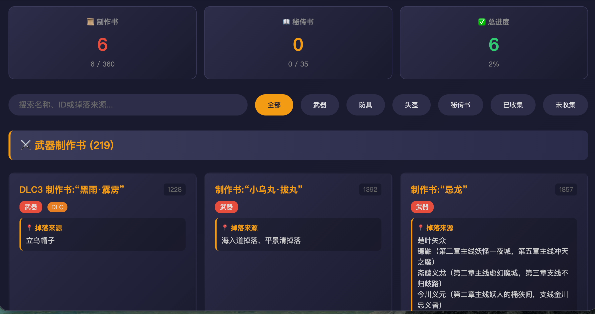

# 仁王2 制作书追踪器 (Nioh 2 Smithing Text Tracker)

一个用于分析《仁王2》游戏存档、追踪制作书收集进度的网页工具。支持中文显示，包含完整的掉落位置信息。

[在线演示](#) | [使用说明](USAGE-GUIDE.md) | [完整列表](制作书完整列表.md)


## ✨ 功能特点

- 📊 **存档分析** - 上传存档文件，自动识别已收集的制作书
- 🇨🇳 **中文显示** - 所有物品名称均有官方中文翻译
- 📍 **掉落信息** - 显示每本制作书的掉落来源、解锁要求和备注
- 🔍 **搜索过滤** - 按名称、ID、掉落来源搜索，按类型过滤
- 📱 **响应式设计** - 支持桌面和移动设备

## 📦 数据来源

本项目基于以下开源项目和社区资料开发：

### 核心数据源

1. **物品ID数据** - [Nioh-2-Save-Editor](https://github.com/alfizari/Nioh-2-Save-Editor)
   - 作者: alfizari
   - 用途: 提供物品ID、英文名称、物品类型等基础数据
   - 文件: `items-official.json`

2. **官方中文名称** - QQ群539591455 "迷桑"分享
   - 来源: 仁王中文社区
   - 用途: 841种物品的官方中文翻译
   - 文件: `official-chinese-names-complete.js`

3. **掉落信息** - [NiohWiki](https://www.niohwiki.com/)
   - 页面: 
     - [二代防具资料和套装效果](https://www.niohwiki.com/mediawiki/index.php?title=二代防具资料和套装效果)
     - [二代武器资料](https://www.niohwiki.com/mediawiki/index.php?title=二代武器资料)
   - 用途: 制作书掉落来源、解锁条件、套装效果等详细信息
   - 文件: `weapon-smithing-drops.js`, `armor-smithing-drops.js`

### 数据统计

| 类别 | 数量 |
|------|------|
| 制作书总数 | 365 种 |
| 秘传书总数 | 35 种 |
| 中文物品名称 | 841 条 |
| 武器掉落信息 | 208 条 |
| 防具掉落信息 | 131 条 |

## 🚀 快速开始

### 在线使用

1. 打开 `index-full-drops.html`
2. 拖拽存档文件到上传区域，或点击"加载示例数据"
3. 查看已收集和未收集的制作书

### 存档格式支持

- **JSON格式** - Nioh2SaveEditor导出的JSON文件
- **二进制格式** - 解密后的 `.bin` 或 `.sav` 文件
- **加密存档** - 自动检测并提示需要先解密

> ⚠️ **注意**: PC版存档默认是加密的，需要使用 [Nioh2SaveEditor](https://github.com/alfizari/Nioh-2-Save-Editor) 的 `pc.exe` 工具先解密。

### 本地运行

```bash
# 克隆仓库
git clone https://github.com/你的用户名/nioh2-smithing-tracker.git

# 进入目录
cd nioh2-smithing-tracker

# 用浏览器打开
open index-full-drops.html
```

## 📁 项目结构

```
nioh2-tracker/
├── index-full-drops.html          # 完整版网页工具（推荐）
├── index-official-cn.html         # 基础中文版
├── official-chinese-names-complete.js  # 中文名称数据库
├── weapon-smithing-drops.js       # 武器掉落数据
├── armor-smithing-drops.js        # 防具掉落数据
├── items-official.json            # Nioh2SaveEditor物品数据
├── 武器制作书掉落指南.md          # 武器掉落文档
├── 防具制作书掉落指南.md          # 防具掉落文档
├── 制作书完整列表.md              # 365本制作书列表
├── README.md                      # 本文件
└── USAGE-GUIDE.md                 # 详细使用说明
```

## 🎮 使用截图

### 主界面


### 物品详情


## 🔧 技术细节

### 存档解析

- **文件头检测**: `NIOHUSR` = 已解密, `7F 9C...` = 已加密
- **物品偏移**: `ITEM_START=0x105EC8`, `ITEM_SIZE=0x88`, `ITEM_SLOTS=900`
- **物品ID格式**: 4位十六进制（如 `7D19`）

### 加密存档

PC版存档使用自定义加密算法，需要：
1. 下载 [Nioh2SaveEditor](https://github.com/alfizari/Nioh-2-Save-Editor)
2. 在Windows系统（或Wine）运行 `pc.exe` 解密
3. 使用解密后的 `decr_SAVEDATA.BIN` 文件

> 注：解密算法未开源，只有编译好的Windows可执行文件。

## 📊 制作书分类

### 按类型
- ⚔️ 武器制作书（刀、枪、斧、锁镰等）
- 🛡️ 防具制作书（轻甲、中甲、重甲）
- 🎭 头盔制作书（面具、头盔、头巾等）
- 💍 饰品制作书（面具、护身符等）
- 📦 特殊物品制作书

### 按来源
- 🎯 任务奖励
- 👹 BOSS掉落
- 📜 修行所任务
- 🎁 特典/DLC

## 🤝 贡献

欢迎贡献代码、翻译或数据更新！

### 数据更新

如果发现数据有误或缺失：
1. 提交 Issue 说明问题
2. 或直接提交 Pull Request

### 翻译改进

中文名称翻译规则在 `chinese-translations.js`，可以添加或修改翻译映射。

## 📝 更新日志

### v1.0.0 (2026-03-11)
- ✅ 初始版本发布
- ✅ 365种制作书数据
- ✅ 841条中文名称
- ✅ 339条掉落信息
- ✅ 存档解析功能
- ✅ 搜索和过滤

## 📄 许可证

本项目采用 MIT 许可证。

## 🙏 致谢

感谢以下项目和社区的资源：

- **[Nioh-2-Save-Editor](https://github.com/alfizari/Nioh-2-Save-Editor)** by alfizari - 物品ID数据
- **[NiohWiki](https://www.niohwiki.com/)** - 掉落信息和套装效果
- **QQ群539591455** "迷桑" - 官方中文名称数据
- **仁王中文社区** - 翻译和攻略贡献

---

**免责声明**: 本工具仅供学习和个人使用，不包含任何游戏原始资源。所有游戏内容和商标归光荣特库摩所有。

Made with ❤️ for Nioh 2 players
